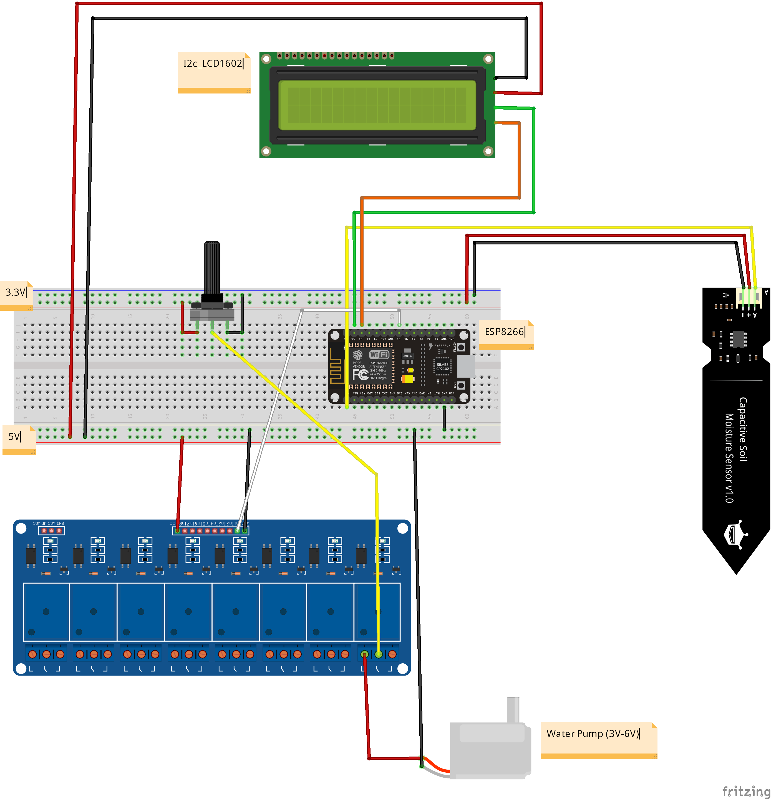

# Plant-It — Smart Watering System 🌿

## ⚙️ Summary

FormFit is a real-time AI-powered pushup form tracker that uses computer vision and a custom-trained TensorFlow model to detect improper reps and provide instant feedback. Originally prototyped on a Raspberry Pi 4 with MediaPipe for body landmark detection, it evolved into a high-accuracy system (94.7%) running on desktop for faster inference and scalability.

**Tech Stack:** Python · OpenCV · MediaPipe · TensorFlow · NumPy · Raspberry Pi 4 

**Key Features:** Real-time pushup form analysis · AI-driven accuracy · Custom CNN model · Scalable architecture for multiple users and exercises · Instant feedback for safer training.

---
## 🔍 Explore

🌐 https://plantit.site/login      
📄 [Project Overview (PDF)](project_overview.pdf)      
🎥 [Demo Video](https://www.youtube.com/watch?v=a0oCiGJgBCo)

---

## 🌱 Background

There are many plants in my house. Every corner you turn, in every room, there is a plant. Thanks to my dad, an avid gardener, my house has become a thriving extension of my backyard garden. However, many plants in the house go without water, far longer than they should. Due to the sheer number of them, it is easy to lose track of the ones that need water. This gave me an idea:  
**What if each plant had its own water supply, which poured just the right amount of water it required?**

---

## 🧠 How It Works

Plant-It automatically identifies your plant, retrieves watering needs, and waters based on live soil readings:

1. **Plant Identification**  
   - Snap a photo of the plant and upload to the web app
   - Use **Pl@ntNet API** to detect species  

2. **Optimal Moisture Retrieval**  
   - Feed species data to **OpenAI API**  
   - Retrieve ideal min/max/optimal soil moisture %  

3. **Microcontroller Logic**  
   - ESP8266 connects via **WiFi** to a web app  
   - Receives min/max/optimal VWC thresholds (once per session)  
   - Reads soil moisture from sensor  
   - Controls water pump via relay, watering only as needed  
   - Displays live status on **I2C LCD**
   - Potentiometer enables control over how much water flows out the pipe at a given time

4. **Web Dashboard**  
   - Built with **React**  
   - Uses **Google Accounts** for individual sign-in  
   - Per-user dashboard to view all plants  
   - See each plant’s watering status, species, family, and care tips  
   - ESP8266 can be paired to any plant at any time, allowing easy swap devices between plants

---

## 🔧 Tech Stack

- **ESP8266 (NodeMCU)** microcontroller  
- **Arduino IDE** (firmware development)  
- **React.js** (web app for plant dashboard)  
- **Google OAuth** (user authentication)  
- **Pl@ntNet API** (plant species identification)  
- **OpenAI API** (optimal moisture range generation)  
- **HTTP / REST** (device ↔ web app communication)  
- **Wi-Fi networking** (ESP8266 local server)  

---

## ⚡️ Electronics Used

1. **8-channel relay module**  
2. **5V / 3.3V breadboard power supply**  
3. **Potentiometer** (to tune pump flow rate)  
4. **LCM1602 I2C LCD display**  
5. **Capacitive soil moisture sensor v1.2**  
6. **3–6V submersible water pump**  
7. **ESP8266 (NodeMCU)** microcontroller

---

## 📐 Wiring Diagram

Here’s the full wiring for Plant-It (ESP8266, relay, moisture sensor, LCD, pump):




---
## 🚀 Quickstart

```bash
git clone https://github.com/yashp1932/Plant-It-Smart-Watering-System.git
cd Plant-It-Smart-Watering-System
```

**1. In Arduino IDE:**
   - Go to Tools → Board → Boards Manager
   - Install: ESP8266 Boards (by ESP8266 Community)
     
**2. Install required libraries (via Arduino Library Manager):**
   - ESP8266WebServer
   - ArduinoJson
   - LiquidCrystal I2C

**3. Select your board:**
   - Tools → Board → NodeMCU 1.0 (ESP-12E Module)
     
**4. Upload code to ESP8266 (NodeMCU)**      

**5. Power the board — and watch it water!** 🌱

 ---
 
## 🤝 Connect

Have ideas to improve Plant-It? I’d love to hear your feedback, questions, or collaboration ideas!

📧 yash.panchal1932@gmail.com  
🌐 [GitHub](https://github.com/yashp1932)  
💼 [LinkedIn](https://www.linkedin.com/in/yash-panchal-9185aa291/)

📧 Kalpkansara123@gmail.com (project partner)      
🌐 [GitHub](https://github.com/KalpKan/PlantWater)        
💼 [LinkedIn](https://www.linkedin.com/in/kalp-kansara123/)      

